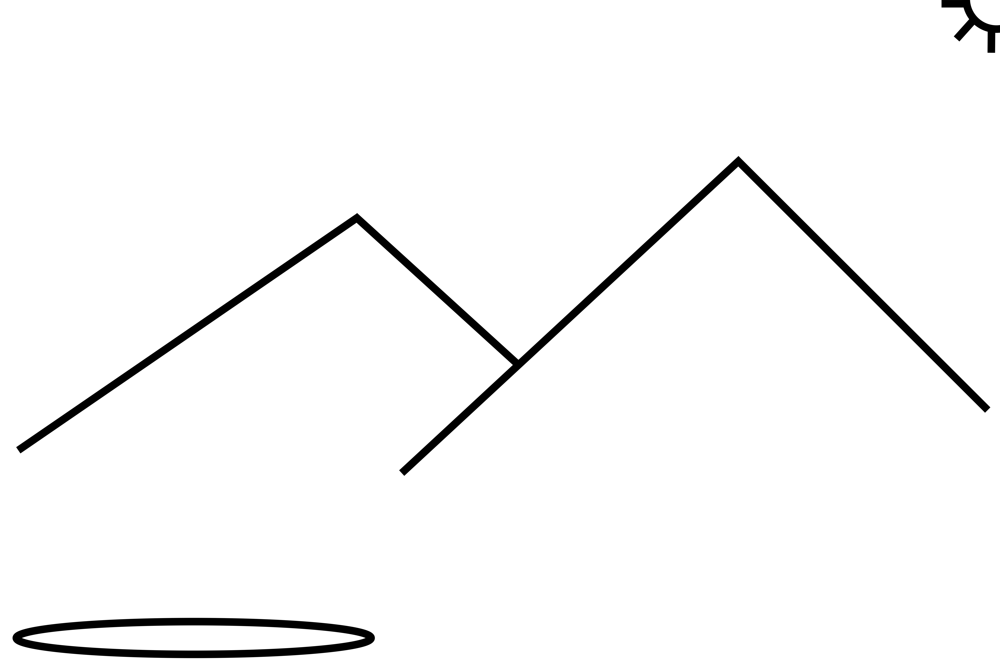
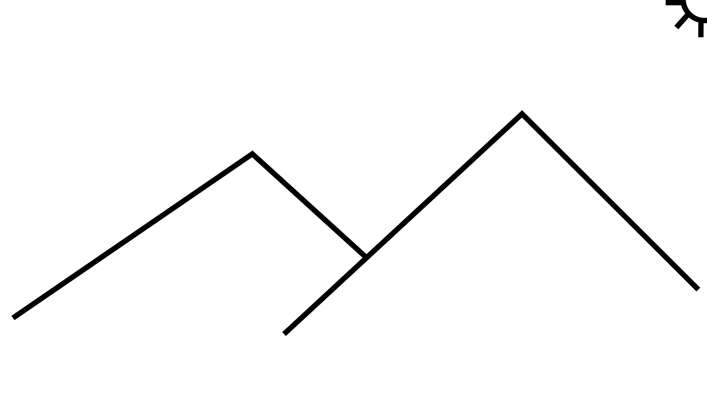
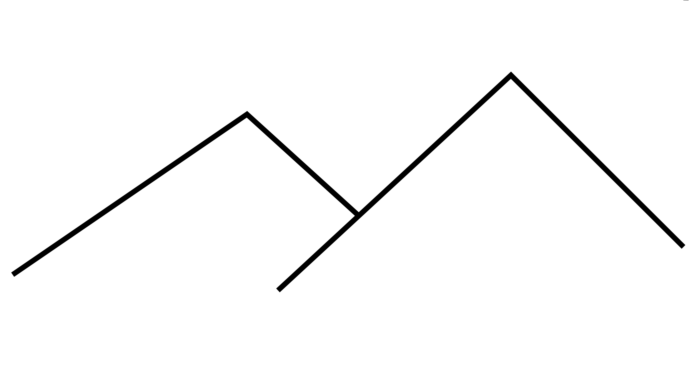
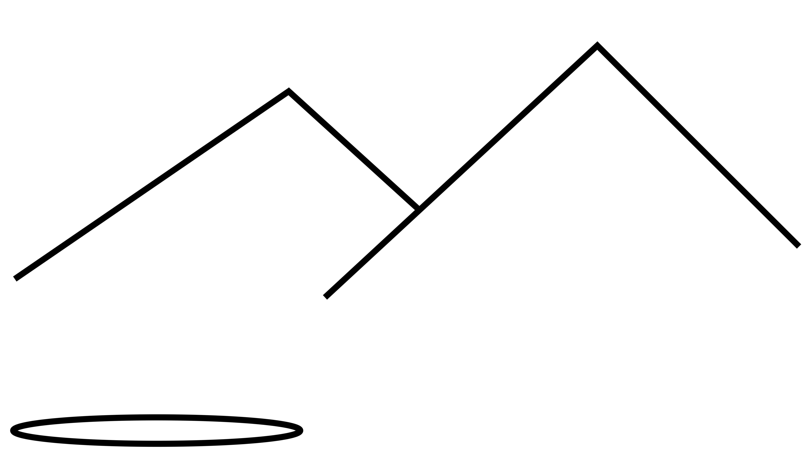
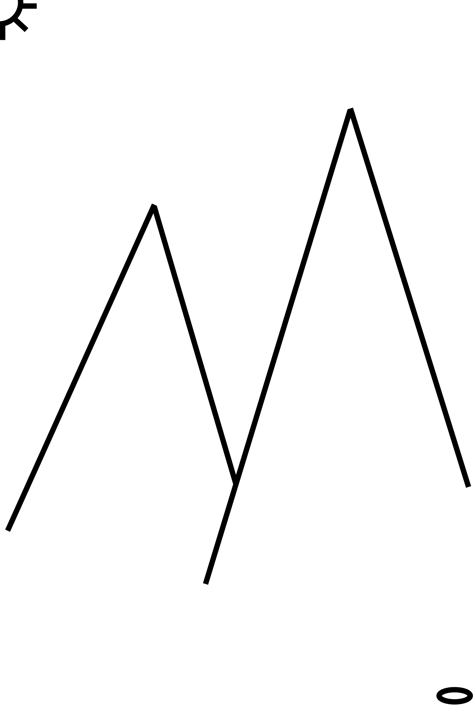
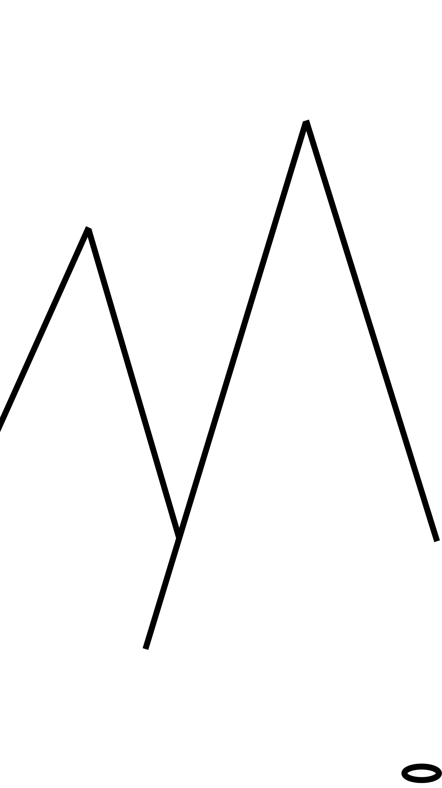
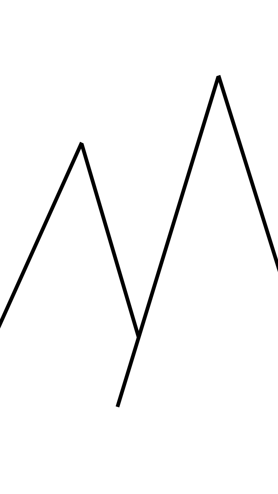
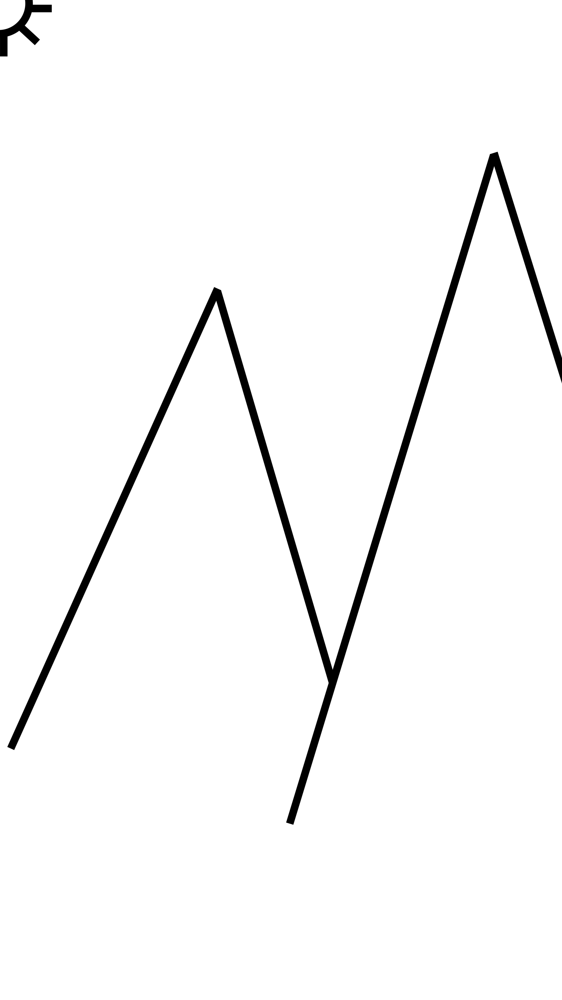

# Desktop Pictures Cropper

This repository contains a Bash script to [crop](https://en.wikipedia.org/wiki/Cropping_(image)) a set of images so that they can be used as native desktop pictures.
The resulting images have the same high resolution as the stock [macOS](https://en.wikipedia.org/wiki/MacOS) desktop pictures.


## You Have

Before you can use the tool in this repository out of the box, you need the following tools preinstalled
 - a recent version of [`exiftool`](https://www.sno.phy.queensu.ca/~phil/exiftool/) (the script has successfully been tested with version 10.59)
 - a recent version of [ImageMagick](https://www.imagemagick.org/script/index.php) that ships with the [`convert`](https://www.imagemagick.org/script/convert.php) programme (the script has successfully been tested with ImageMagick 6.9.9-26 Q16 x86_64 2018-03-07)

Moreover, you need
 - a collection of landscape or portrait images
 - to decide how to crop each image


## You Want

After cropping the images, you get
 - `5120px x 2880px` high resolution _landscape_ desktop pictures
 - `2880px x 5120px` high resolution _portrait_ desktop pictures

Here, the images are output to corresponding sub-directories named `Landscape` and `Portrait` and can be used as macOS desktop pictures as is. Note that the final image size can be configured if needed. See the FAQs for details.


## Pre-Sorting the Images

The cropping script requires your input in deciding which section of the image to crop.
The section to crop is determined by the folder the image is located in. Here, folder names are chosen to _represent the area that is unaffected by the cropping_.


### Landscape Images

There are three options available for _landscape_ images:

 1. North
 2. Center
 3. South

Consider the following example of a lovingly handcrafted example landscape image



The items in the image roughly represent 
 - the sun in the upper right hand corner,
 - two mountains in the middle, and 
 - a pond in the bottom left hand corner.

#### North

This option preserves the top section of the image and clips a bottom section of the image. For the example landscape image, the resulting cropped image is



Here, note how the _pond at the bottom left hand corner has been cropped_.

#### Center

This option preserves the center section of the image and clips an equal section of the top and bottom of the image. For the example landscape image, the resulting cropped image is



Here, note how the _sun in the upper right hand corner as well as the pond at the bottom left hand corner have been cropped_.

#### South

This option preserves the bottom section of the image and clips a top section of the image. For the example landscape image, the resulting cropped image is



Here, note how the _sun in the upper right hand corner has been cropped_.


### Portait Images

There are three options available for _portrait_ images:

 1. East
 2. Center
 3. West

Consider the following example of a lovingly handcrafted example portrait image



The items in the image again roughly represent 
 - the sun in the upper left hand corner,
 - two mountains in the middle, and 
 - a pond in the bottom right hand corner.

#### East

This option preserves the left hand section of the image and clips a section on the right hand side of the image. For the example portrait image, the resulting cropped image is



Here, note how the _sun in the upper left hand corner has been cropped_.

#### Center

This option preserves the center section of the image and clips an equal section of the left and right hand side of the image. For the example portrait image, the resulting cropped image is



Here, note how the _sun in the upper left hand corner as well as the pond at the bottom right hand corner have been cropped_.

> In order to avoid duplication, the same `Center` folder is _used for both landscape and portrait images_.

#### West

This option preserves the right hand section of the image and clips a section on the left hand side of the image. For the example portrait image, the resulting cropped image is



Here, note how the _pond in the bottom right hand corner has been cropped_.


## Execution

The stand-alone Bash script `cropper.sh` is located in the root folder. It requires an `<input-directory>` of pre-sorted background images (see above for details) as well as an `<output-directory>` where to write the cropped images to. In case the `<output-directory>` does not exist, it is created.

Note that all landscape images are eventually located in `<output-directory>/Landscape/`. All portrait images are eventually located in `<output-directory>/Portrait/`.

All pre-sorted images in `Originals/` can be cropped and output to `Cropped/` via
```
cropper.sh "Originals/" "Cropped/"
```


## Output File Naming and Caching

Each image `<name>.<suffix>` located in the input directory is eventually converted to `<name>.jpg` in the output directory. Here, `<suffix>` is a file extension `convert` can handle.

As converting and cropping images can be a time consuming task, the Bash script treates each file `<name>.jpg` in the output directory as the converted and cropped image of `<name>.<suffix>`. Hence, `<name>.<suffix>` is assumed to have already been converted and is subsequently ignored.


## FAQs

### What's the Resolution of the Resulting Landscape Desktop Pictures?

The cropped landscape desktop pictures are `5120px x 2880px`. Note that this is also the resolution of the stock macOS desktop pictures in `/Library/Desktop Pictures`


### What's the Resolution of the Resulting Portrait Desktop Pictures?

The cropped portrait desktop pictures are `2880px x 5120px`.


### How Can I Change the Resolution of Landscape Images?

The cropping values for landscape images are defined in variables
 - `LANDSCAPE_WIDTH`
 - `LANDSCAPE_HEIGHT`

at the beginning of `cropper.sh`. Adjust them as needed.


### How Can I Change the Resolution for Portrait Images?

The cropping values for portrait images are defined in variables
 - `PORTRAIT_WIDTH`
 - `PORTRAIT_HEIGHT`

at the beginning of `cropper.sh`. Adjust them as needed.
